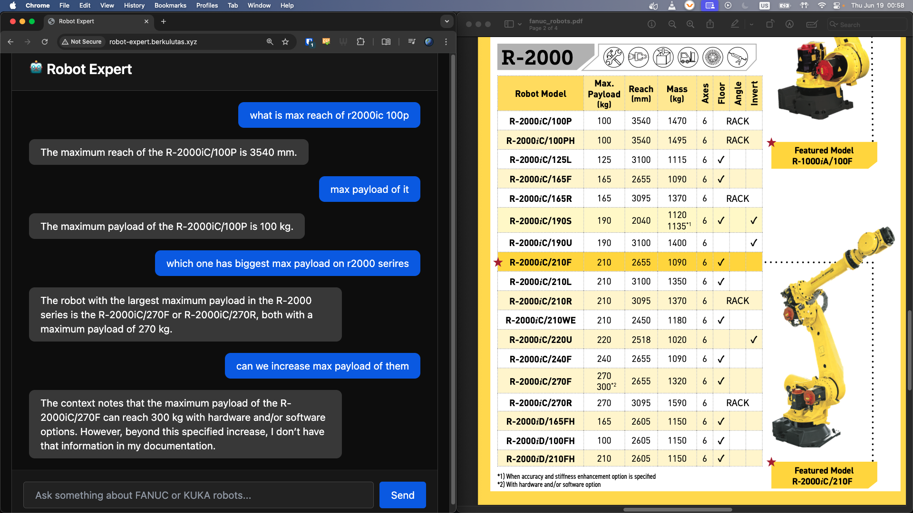

# 🤖 Multi-Agent Robot Expert Chatbot

**Your instant documentation assistant for industrial robots.**

*See the chatbot in action!*

## What is this?

The **Multi-Agent Robot Expert Chatbot** is an AI-powered assistant that helps engineers and technicians get fast, reliable answers from official robot documentation—no need to search through manuals yourself!

**Try it live:** [robot-expert.berkulutas.xyz](http://robot-expert.berkulutas.xyz/)

## What can it do?

- **Instant Answers from Manuals:**  
  Ask technical questions about supported industrial robots and get clear, accurate answers—directly from the official documentation.

- **Smart Agent Routing:**  
  The chatbot automatically understands your question and sends it to the right expert agent for the robot family (currently KUKA and FANUC).

- **No Guesswork:**  
  All answers are based strictly on the official PDF manuals, so you can trust the information.

- **Handles Out-of-Scope Questions:**  
  If you ask about a robot brand that isn't supported yet, or something not in the documentation, the chatbot will let you know.

- **Keeps the Conversation Going:**  
  Remembers your previous questions for a smooth, contextual chat.

## Who is it for?

- **Engineers & Technicians** who work with industrial robots and need quick answers from documentation
- **Students** learning about robotics and automation
- **Support teams** who need reliable, up-to-date robot info

## Example Questions

- *"What is the repeatability of the KR 10 R1100?"*  
  → *"The KR 10 R1100 has a repeatability of ±0.02 mm."*

- *"Show me the maximum payload curve for the LR-Mate 200iD."*  
  → *"Here is the maximum payload curve for the LR-Mate 200iD:"* (with image, if available)

- *"What is the reach of the ABB IRB 120?"*  
  → *"Sorry, I only respond to questions about KUKA and FANUC robots."*

- *"Which gearbox is used inside the wrist of the KR 10 R1100?"*  
  → *"I don't have that information in my documentation."*

## How to Use

1. **Go to:** [robot-expert.berkulutas.xyz](http://robot-expert.berkulutas.xyz/)
2. **Type your question** about a supported robot.
3. **Get your answer** instantly, with references from the official manuals.

## How does it work?

- **AI Agents:** Specialized for each robot family, trained only on their official PDF manuals.
- **Orchestrator:** Decides which agent should answer, or if the question is out of scope.
- **Retrieval-Augmented Generation (RAG):** Ensures answers are always based on the actual documentation.

## FAQ

**Q: Can I ask about any robot?**  
A: The chatbot is designed for all industrial robots, but currently supports KUKA and FANUC. More brands coming soon!

**Q: Where do the answers come from?**  
A: All answers are based on the official PDF manuals for each robot.

**Q: Is my conversation private?**  
A: Your questions are only used to provide answers and improve the service.

*Built with ❤️ for engineers and technicians who want fast, reliable answers from robot documentation*